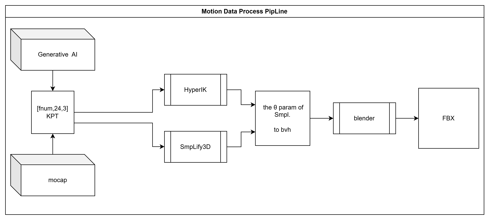

# MotionProcessTools
 useful tools for motion data processing, related to SMPL, BVH, FBX, etc.

<!-- 插入照片 -->



# SetUP

python==3.11


```bash
pip install -r requirements.txt
```

## prepare the SMPL model
follow the [motionGPT](https://github.com/OpenMotionLab/MotionGPT) to prepare the smpl model, you should set them as the following structure.
<pre>
📦deps
 ┗ 📂smpl
 ┃ ┗ 📂smpl_models
 ┃ ┃ ┣ 📂smpl
 ┃ ┃ ┃ ┣ 📜readme.txt
 ┃ ┃ ┃ ┣ 📜SMPL_FEMALE.pkl
 ┃ ┃ ┃ ┣ 📜SMPL_MALE.pkl
 ┃ ┃ ┃ ┗ 📜SMPL_NEUTRAL.pkl
 ┃ ┃ ┣ 📜gmm_08.pkl
 ┃ ┃ ┣ 📜neutral_smpl_mean_params.h5
 ┃ ┃ ┣ 📜smpl.faces
 ┃ ┃ ┣ 📜smpl.tar.gz
 ┃ ┃ ┣ 📜smplx_parts_segm.pkl
 ┃ ┃ ┗ 📜SMPL_downsample_index.pkl
</pre>


# Usage


## 1.Kalman_Filter for SMPL-like joints npy data

if your mocap data is noisy, you can use Kalman_Filter to smooth the data.

this way is 
<b>notice:</b> the data should be transfor to SMPL joints.

```bash
python ./tools/Kalman_Filter.py
```

## ~~2. SMPL Joints to BVH~~
modify the setting in joints2bvh.py, then run the script.
```bash 
python joints2bvh.py
```
based on [animationGPT](https://github.com/fyyakaxyy/animationGPT) for this part.

#### trans joints[fnum, 24, 3] to smpl pose parameters


## 3. SMPL Joints to pose param θ
### 3.1 using symplify3d 
this part comes form [motionGPT](https://github.com/OpenMotionLab/MotionGPT)
```bash
python -m Smplify3D.fit --dir YOUR_JOINTS_FOLDER --save_folder DIR_TO_SAVE --cuda 0
```
this will fit joints to smply, and generate the SMPLPose.pkl which is for bvh;
and generate mesh.npy in the same folder in YOUR_JOINTS_FOLDER, which is for render; 
### 3.2 using naive-HyberIK

```bash
python -m HyberIK.fit -- dir YOUR_JOINTS_FOLDER --save_folder DIR_TO_SAVE --cuda 0
```
## 4. SMPL pose param θ to bvh

once you get the SMPLPose.pkl, you can use the following script to generate bvh file.

```bash
python smpl2bvh.py --gender MALE --poses ${PATH_TO_Y0UR_INPUT} --fps 60 --output ${PATH_TO_SAVE} --mirror
```
you can find more details on this [smpl2bvh](https://github.com/KosukeFukazawa/smpl2bvh)


Smplify3D(left) and HyberIK(right) 
## 5. BVH to FBX

you need to install blender at first

```bash
Path_to_your_blender -b --python ./tools/bvh2fbx.py -- --BVHF BVH_FOLDER_PATH [--FBXF FBX_FOLDER_PATH]
```

you can use fbx in unity and UE to make animation now :) enjoy it.


# Related
- [animationGPT](https://github.com/fyyakaxyy/animationGPT)
- [AvatarSoul](https://github.com/Gelercatty/AvatarSoul)
- [motionGPT](https://github.com/OpenMotionLab/MotionGPT)
- [smpl2bvh](https://github.com/KosukeFukazawa/smpl2bvh)

thanks for their great work.
